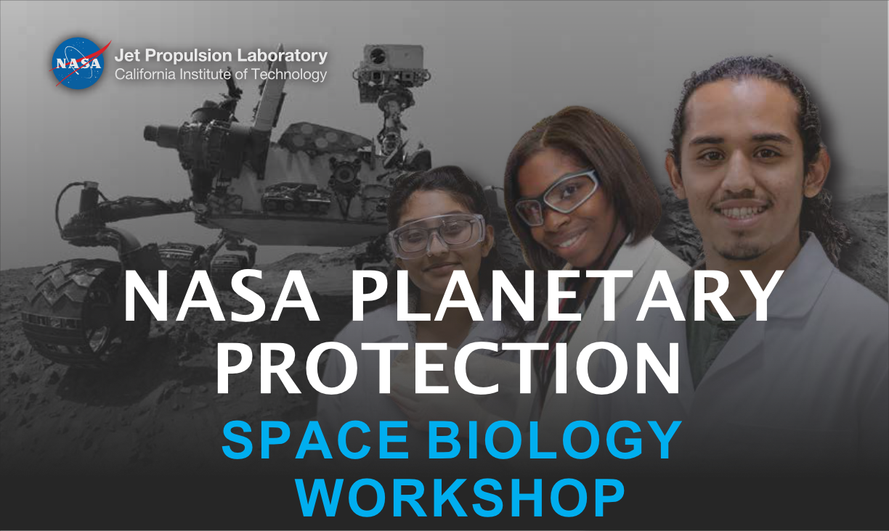

# JPL-2024-PRISM
The bioinformatics portion of the 2024 JPL Preparing for Research in Space Microbiology (PRISM) program takes place on April 22nd. This is the primary github repository, **please see the wiki [here](https://github.com/AstrobioMike/JPL-2024-PRISM/wiki).**

